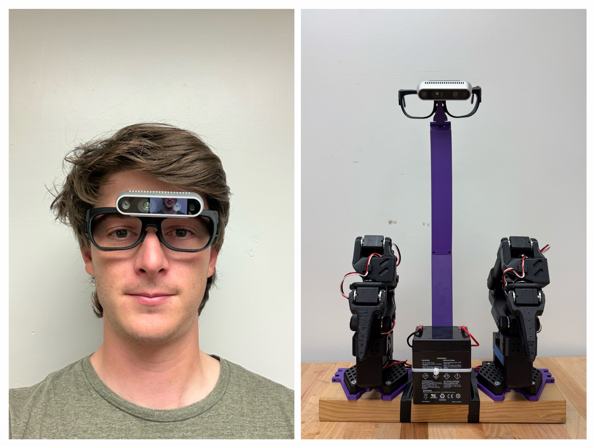

# Vision-Based-Hand-Shadowing-for-Robotic-Manipulation-via-Inverse-Kinematics

robot teleoperation using computer vision and hand tracking for robot control.

## Authors

- Hendrik chiche  
  hendrik_chiche@berkeley.edu
- Antoine Jamme  
  antoine_jamme@berkeley.edu
- Trevor Rigoberto Martinez  
  tre_mart@berkeley.edu


## Installation

### 1. Install Dependencies

```bash
# Install vbhs package in editable mode
pip install -e .
```

### 2. Hardware Requirements

- **RealSense Camera**: For RGB-D input and hand tracking
- **SO-101 Robot**: Dual-arm robot for physical execution (optional for simulation-only use)




## Main Scripts

### 1. Collect and Replay (`collect_and_replay.py`)

**Primary workflow script** for recording human demonstrations and replaying them on robot.

#### Complete Pipeline:
1. **Record** human demonstration using RealSense camera
2. **Process** bag file to extract robot actions
3. **Replay** in PyBullet simulator for validation
4. **Execute** on physical robot

#### Usage:

```bash
sudo python -m vbhs.scripts.collect_and_replay \
    --robot.type=so101_follower \
    --robot.port=/dev/tty.usbmodem58FA0958041 \
    --robot.id=right_follower
```

#### Configuration (PlaybackConfig in `action_playback.py`):

**Robot Connection:**
- `robot.type`: Robot type (e.g., `so101_follower`)
- `robot.port`: Serial port for robot communication
- `robot.id`: Robot identifier

**Recording & Playback:**
- `fps`: Recording frame rate (default: 30)
- `simulator_fps`: Simulation playback rate (default: 30)
- `output_dir`: Directory for saved files (default: `"vbhs_output"`)
- `urdf`: Path to robot URDF file

**Robot Motion Control:**
- `acceleration_limit`: Joint acceleration (0-254, lower = smoother, default: 50)
- `gripper_acceleration_limit`: Gripper acceleration (default: 100)
- `velocity_limit`: Joint velocity in RPM (default: 1500)
- `gripper_velocity_limit`: Gripper velocity in RPM (default: 3000)

**PID Tuning:**
- `p_coefficient`: Proportional gain (default: 12)
- `i_coefficient`: Integral gain (default: 0)
- `d_coefficient`: Derivative gain (default: 24)

**Gripper Behavior:**
- `gripper_mode`: Control mode (`NORMAL`, `BINARY`, `OFFSET`)
- `gripper_threshold_deg`: Threshold for binary mode (default: 60°)
- `gripper_open_deg`: Open position (default: 90°)
- `gripper_closed_deg`: Closed position (default: 0°)

#### Output Files:
- `human_demo.bag`: Raw RealSense recording
- `*_actions.npy`: Extracted robot joint commands
- `*.mp4`: RGB/depth video recordings

### 3. Playback on Robot (`playback_on_robot.py`)

**Direct playback** of pre-recorded robot actions on physical robot.

#### Usage:

```bash
sudo python -m vbhs.scripts.playback_on_robot \
    --actions_file human_demo_actions.npy \
    --robot.type=so101_follower \
    --robot.id=right_follower
```

#### Parameters:
- `--actions_file`: Path to saved action file (`.npy` format)
- `--robot.type`: Robot type specification
- `--robot.port`: Serial port for robot communication
- `--robot.id`: Robot identifier (e.g., `right_follower`, `left_follower`)

## Configuration

Edit `config.py` for:
- Camera-to-robot transformation parameters
- Gripper control ranges and mapping
- Hand landmark indices and processing settings


